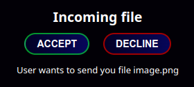

### Overview 
AirShare is a server which receives files through the nearby-share protocol on the local network. You can send files from any(?) modern android phone and find them inside the mounted download folder.

# 

Currently the docker build, as it's supposed to run on the server, it accepts all requests so it probably shouldn't be ran in untrusted networks.

The desktop app prompts before every transfer for confirmation.



#

#### Example docker-compose.yaml
```
version: "3.4"
services:
  service:
    network_mode: host
    image: hotspaghetti/airshare:latest
    restart: unless-stopped
    environment:
      DEVICE_NAME: "Docker server"
      DOWNLOAD_PATH: "/downloads"
    volumes:
      - ./path/to/received/files:/downloads
```

#

### Build desktop app
You need to have protoc installed on your system for the build script to be able to generate the protobuf files.
```
cargo tauri build -f tauri-app
```

### Build docker image
```
sudo docker build . -t hotspaghetti/airshdare:latest
```
